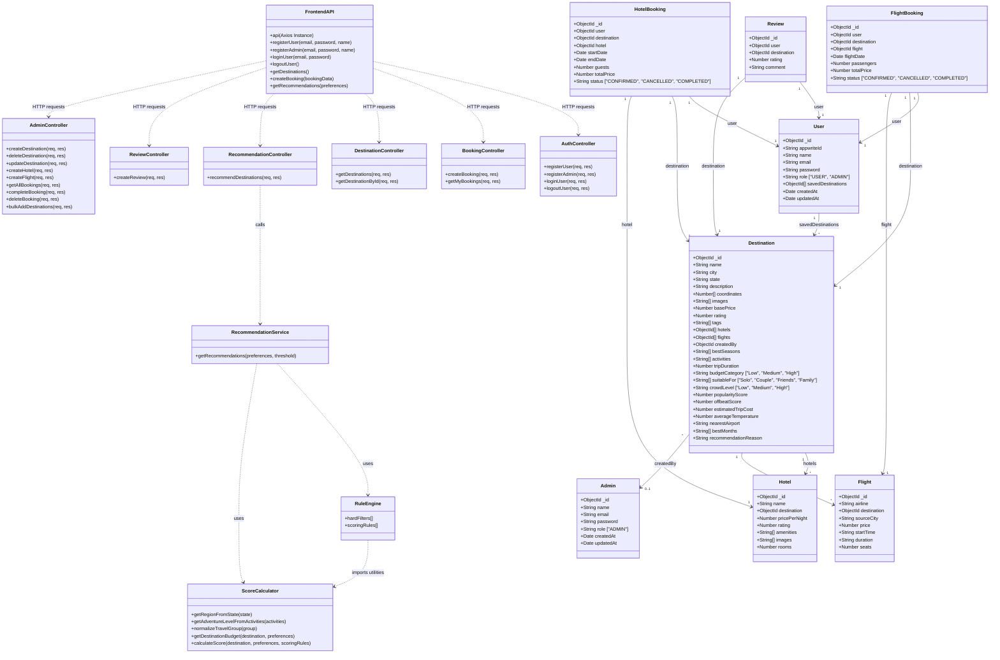

# 🗺️ Travel & Tourism Application Diagrams

This document outlines the **Flow Diagram** (how the application runs and processes data across different features) and the **Class Diagram** (how the code, components, services, and database schemas are structured and relate to one another).

---

## 🔄 1. Overall Application Flow Diagram

The application is structured into key interaction flows between the **React Frontend**, the **Node/Express Backend**, and the **MongoDB Database**. Below is a comprehensive flow diagram representing all the system processes.

```mermaid
graph TD
    %% Subgraph Definitions %%
    subgraph Frontend ["Frontend (React Client)"]
        UI["User Interface (App.jsx)"]
        Pages["React Pages (Home, Destinations, Profile, Admin)"]
        AuthF["Auth Flow (Login/Signup)"]
        RecPage["Recommendation Page & PreferenceForm"]
        BookingF["Booking Flow (DetailsModal)"]
        ApiClient["API Client (lib/api.js & recommendationService.js)"]
        LocalStr["Local Storage (JWT Token / User Info)"]
    end

    subgraph Backend ["Backend (Express Server)"]
        Router["Express Router (server.js)"]
        Routes["APIs (/auth, /destinations, /bookings, /reviews, /admin, /api)"]
        Mware["Middlewares (protect, adminMiddleware)"]
        Ctrl["Controllers (auth, booking, destination, recommendation, review, admin)"]
        RecServ["Recommendation Service (recommendation.service.js)"]
        Rules["Rule Engine & Score Calculator"]
    end

    subgraph Database ["Database Layer"]
        DB[(MongoDB Database)]
    end

    %% Flow Connections %%
    UI --> Pages
    Pages --> AuthF
    Pages --> RecPage
    Pages --> BookingF

    %% Authentication Flow %%
    AuthF -->|Credentials| ApiClient
    ApiClient -->|POST /auth/login or /register| Router
    Router --> Routes
    Routes -->|auth.controller.js| Ctrl
    Ctrl -->|bcrypt & JWT Sign| DB
    DB -.->|User Records| Ctrl
    Ctrl -->|JWT Token + User Profile| ApiClient
    ApiClient -->|Save JWT| LocalStr

    %% Recommendation Engine Flow %%
    RecPage -->|Preferences (Budget, Season, crowd, etc.)| ApiClient
    ApiClient -->|POST /api/recommend| Router
    Router --> Routes
    Routes -->|recommendation.controller.js| Ctrl
    Ctrl -->|Invoke getRecommendations| RecServ
    RecServ -->|Destination.find().populate()| DB
    DB -.->|All Destination Docs| RecServ
    RecServ -->|Evaluate hardFilters & scoringRules| Rules
    Rules -.->|Calculated Match Score & Rules| RecServ
    RecServ -->|Sort & Filter by Score Threshold| Ctrl
    Ctrl -->|JSON Recommendations List| ApiClient
    ApiClient -->|Render cards, score badges, map coordinates| RecPage

    %% Booking Flow %%
    BookingF -->|Auth Header: Bearer Token| ApiClient
    ApiClient -->|POST /bookings| Router
    Router --> Mware
    Mware -->|Verify JWT via User model| DB
    Mware -->|Attach User to req.user| Ctrl
    Ctrl -->|Create Booking| DB
    DB -.->|Booking confirmation| Ctrl
    Ctrl -->|JSON Success Response| ApiClient
    ApiClient -->|Show Success Toast / Redirect to Profile| BookingF

    %% Review Flow %%
    Pages -->|Submit Review| ApiClient
    ApiClient -->|POST /reviews (JWT Protected)| Router
    Router --> Mware
    Mware --> Ctrl
    Ctrl -->|Save Review Schema| DB
    Ctrl -->|Success Status| ApiClient

    %% Admin Management Flow %%
    Pages -->|Admin Actions (Add Dest/Hotel/Flight)| ApiClient
    ApiClient -->|POST/PUT/DELETE /admin/* (JWT)| Router
    Router --> Mware
    Mware -->|Check if req.user.role === ADMIN| Ctrl
    Ctrl -->|Perform CRUD Operations| DB
    DB -.->|Database Updated| Ctrl
    Ctrl -->|Success Response| ApiClient
```

---

## 🏷️ 2. Class & Data Schema Diagram

This diagram represents the structural layout of the codebase, modeling Javascript schemas (MongoDB/Mongoose), Controllers, services/utils, and their relationships.



---

## 🗂️ 3. Component Details & Descriptions

### Database Models (Mongoose Schemas)
- **User / Admin**: Handle authentication details and profiles. Users can save destinations to their accounts, while Admins manage destination configurations.
- **Destination**: The main content unit. Includes location information, base pricing, travel duration, and advanced metadata (seasons, activities, crowd level, popularity score) used by the personalization engine.
- **Hotel / Flight**: Linked child components of a destination, allowing dynamic itinerary recommendations and complete pricing packages.
- **FlightBooking / HotelBooking**: Track transaction and scheduling statuses for users traveling to specific destinations.
- **Review**: Enables rating aggregation to adjust overall destination popularity and quality indicators.

### Personalization Logic Layer
- **ScoreCalculator**: Utility functions that parse and normalise unstructured user data (like region mappings for Indian states, matching budget limits, and normalizing group categories) to run quantitative analytics on candidate destinations.
- **RuleEngine**: Implements extensible rule chains divided into:
  1. *Hard Filters*: Eliminates candidates immediately if they exceed budget constraints or lack suitability (e.g., matching a family trip format).
  2. *Scoring Rules*: Accumulates weighted percentage scores (Interest Match = 30%, Budget Match = 20%, Season Match = 15%, etc.) up to a maximum score of 100.
- **RecommendationService**: The orchestrator. Loads all destinations, evaluates them against filters, performs scoring calculations, filters out options that fall below a minimum match threshold (default 40), and sorts recommendations in descending order.
